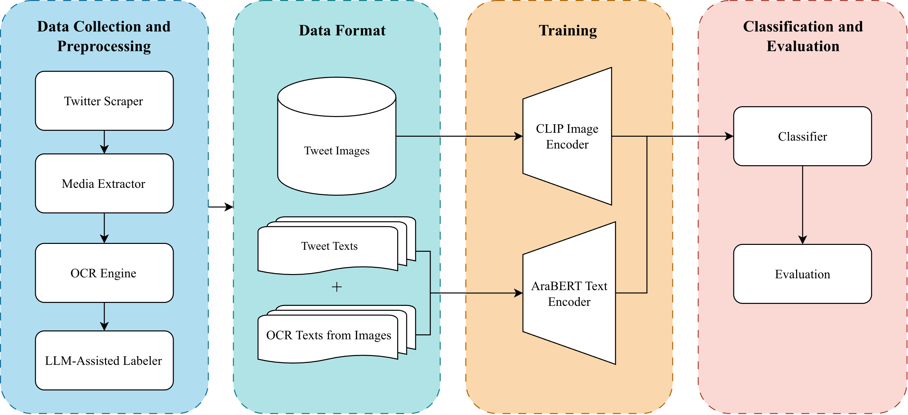

# Multimodal Detection of Arabic Health Misinformation

This repository contains the codebase for a multimodal deep-learning pipeline
that detects health misinformation in Arabic social-media posts by jointly
analyzing tweet text, OCR-extracted image text, and visual content.

<p align="center">
  
</p>

<p align="center">
  <em>Overview of the multimodal Arabic health misinformation detection pipeline.</em>
</p>

## Overview
Health misinformation on social media poses a serious public-health risk, particularly when misleading textual claims are reinforced by persuasive visual content.This repository implements the full experimental pipeline described in our IEEE-style study *“The Image Behind the Claim: Multimodal Detection of Arabic Health Misinformation.”*

The system jointly analyzes:

*   Tweet text
*   OCR-extracted text from images
*   Visual image content
    
to classify Arabic social-media posts into three categories:true, false or misleading health claims.
The codebase emphasizes reproducibility, modularity, and alignment with academic experimentation standards.


## Pipeline Flow
1. Tweet Collection: Arabic health-related tweets are collected using TwitterAPI.io, targeting medical, wellness, parenting, and lifestyle claims.
2. Media Filtering & Image Download: Tweets are filtered to retain only posts containing images. Images are downloaded locally and indexed.
3. OCR Extraction: Text embedded inside images is extracted using Tesseract
4. LLM-Assisted Labeling: Tweets are labeled as *true*, *false*, or *misleading* using a medically constrained LLM prompt aligned with public-health consensus.
5. Text Preprocessing (AraBERT-Compatible):
    *   Unicode normalization
    *   Diacritic removal
    *   Letter unification
    *   Arabic digit normalization
    *   Tweet and OCR text concatenation
6. Multimodal Representation Learning:
    *   AraBERT: encodes rich Arabic textual semantics
    *   CLIP: aligns image and text into a shared embedding space    
7. Multimodal Fusion & Classification:
    *   CLIP embeddings + AraBERT embeddings are concatenated
    *   Logistic Regression / shallow MLP classifiers are trained and evaluated


## Repository Structure
```bash
arabic-health-twitter-pipeline/
│
├── src/                    # Core pipeline modules
│   ├── collector.py        # Tweet collection
│   ├── build_dataset.py    # Dataset construction
│   ├── add_ocr_to_dataset.py
│   ├── add_labels_to_dataset.py
│   ├── download_images.py
│   ├── deduplicate.py
│   └── run_pipeline.py     # End-to-end execution
│
├── notebooks/              # Experimental notebooks
│   ├── clip_arabert_embeddings.ipynb
│   └── classification.ipynb
│
├── assets/
│   └── pipeline.png        # Pipeline figure (paper-aligned)
│
├── data/                   # Intermediate datasets (gitignored)
├── tweet_images/           # Downloaded images (gitignored)
│
├── requirements.txt
└── README.md
```

## Setup
```bash
# Create environment
python3 -m venv .venv
source .venv/bin/activate

# Install dependencies
pip install -r requirements.txt
```

## Configuration
```bash
# Create a .env file in the project root
TWITTERAPI_KEY=your_twitterapi_io_key
OPENAI_API_KEY=your_openai_key
```

## Running the Full Pipeline
```bash
# run pipeline
python3 -m src.run_pipeline
```

## Experiments
All experiments are reproducible via the notebooks in notebooks/:
- CLIP + AraBERT embeddings
- Multimodal classification
- Error analysis
- Visualization (class distribution, confusion matrix)

## Citation
If you use this code or dataset, please cite:
```bash
@inproceedings{alshiha2025multimodal,
  title={The Image Behind the Claim: Multimodal Detection of Arabic Health Misinformation},
  author={Alshiha, Farah and others},
  booktitle={IEEE Conference Proceedings},
  year={2025}
}
```

## Acknowledgments
- OpenAI (CLIP)
- AraBERT authors
- TwitterAPI.io
- Arabic fact-checking initiatives (Misbar, Fatabyyano)
